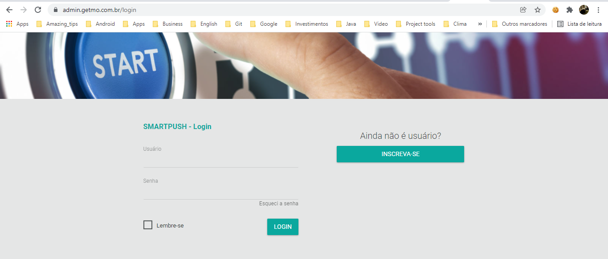
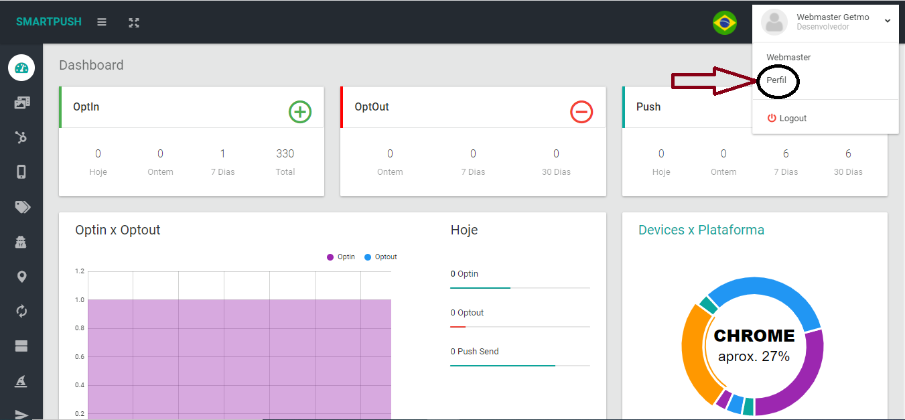
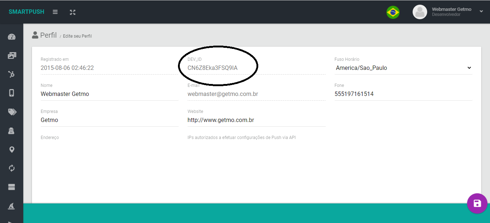
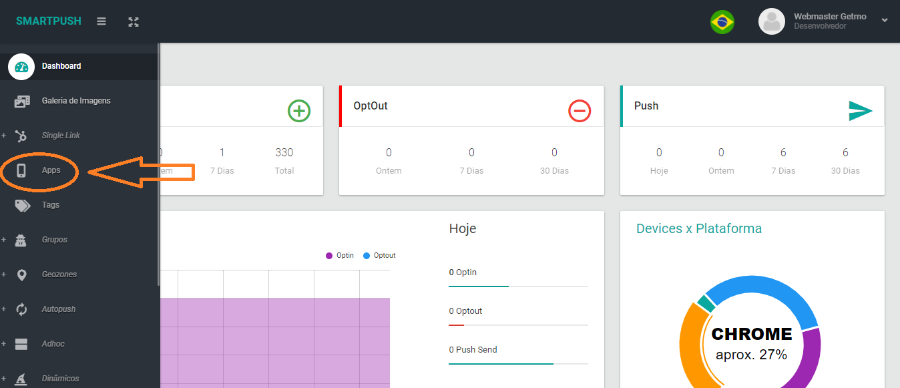
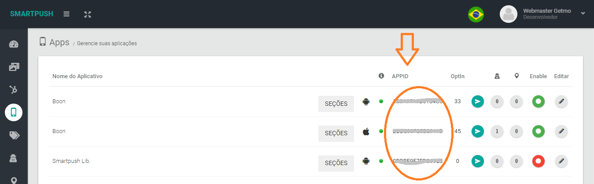

# Smartpush - Credenciais de configuração da SDK

Acesse o painel da plataforma SMARTPUSH disponível [aqui](https://admin.getmo.com.br) e informe seus dados de acesso.

> Se não tiver um usuário, crie um, ou solicite ao nosso time técnico através do email **developer@getmo.com.br**.

Localize o menu no alto a direita e acesse a opção **Perfil**.

Copie, e guarde, o código DEV_ID (ou API_KEY), ele é uma das informações para a configuração da SDK SMARTPUSH.

Agora para obter o APP_ID, acesse o menu a esquerda e localize a opção APP.

Na listagem de apps, localize a app que você está configurando e copie, e guarde, o APP_ID. 

> Deve existir uma app para cada plataforma alvo (ANDROID, iOS, CHROME, FIREFOX, SAFARI) da sua aplicação.

Pronto! Com essas duas informações você conseguirá concluir a configuração da SDK do SMARTPUSH no seu projeto mobile. 

Se tiver qualquer dúvida ou dica envie um email a nossa equipe **developer@getmo.com.br**, teremos o maior prazer em te auxiliar.