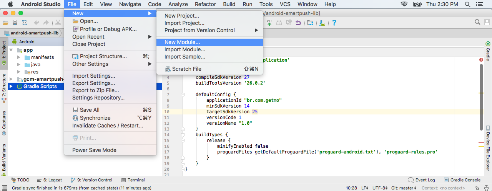
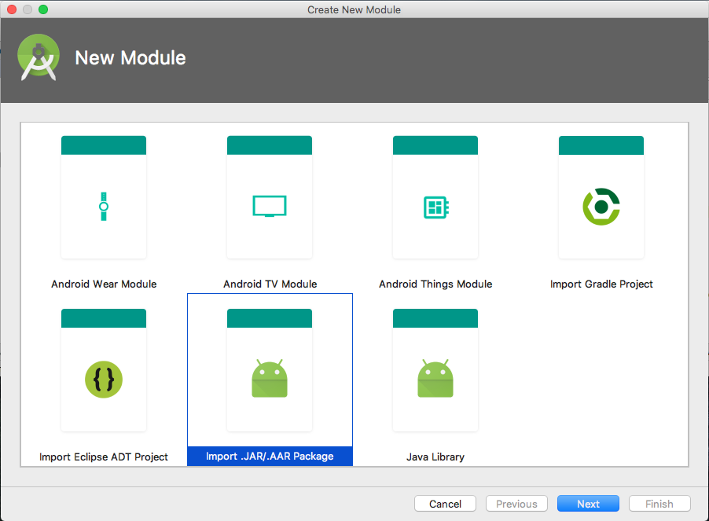
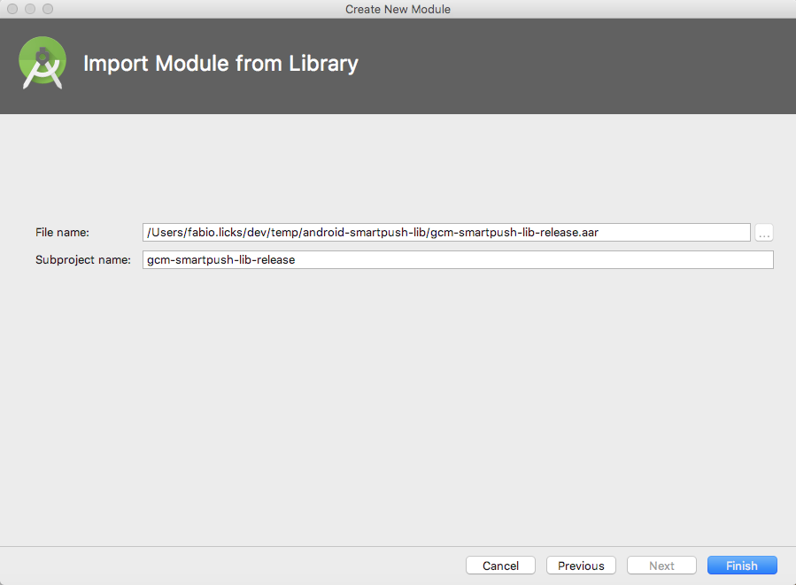
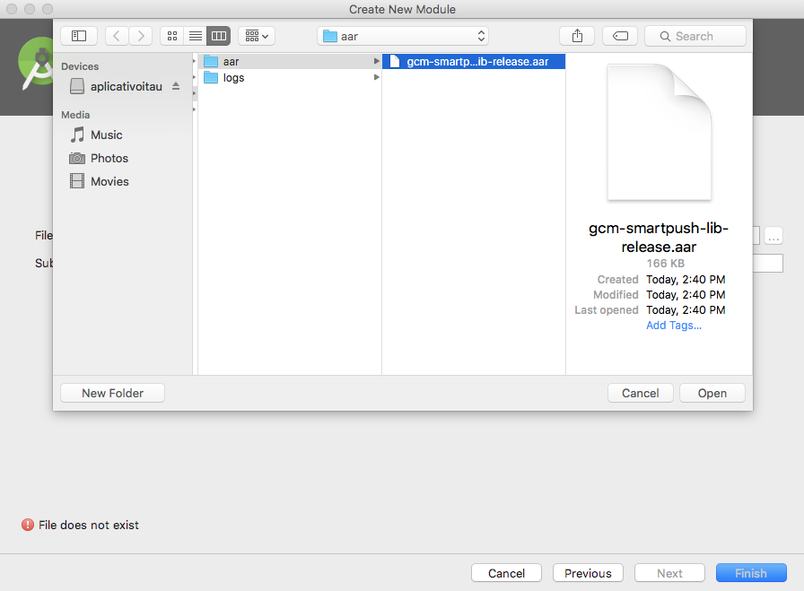
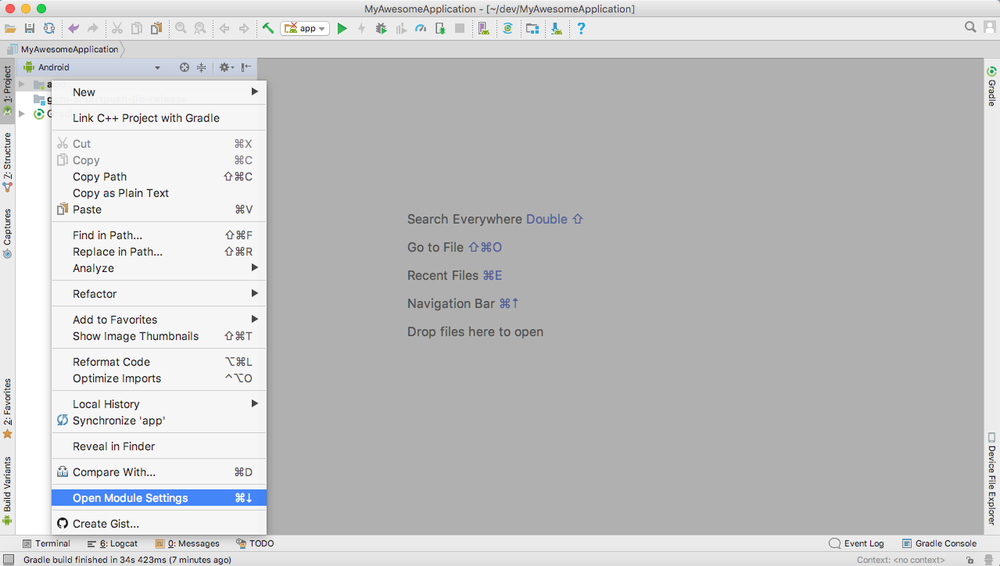
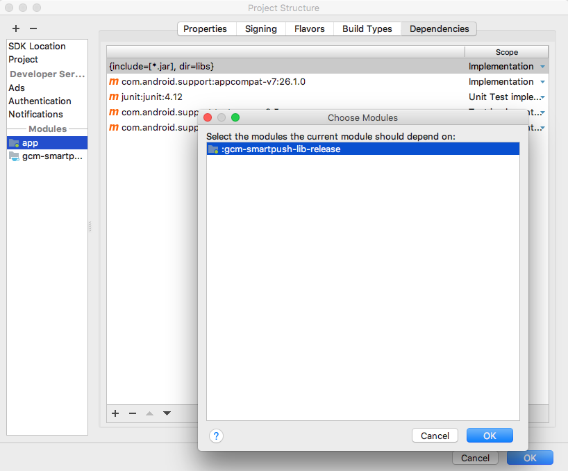
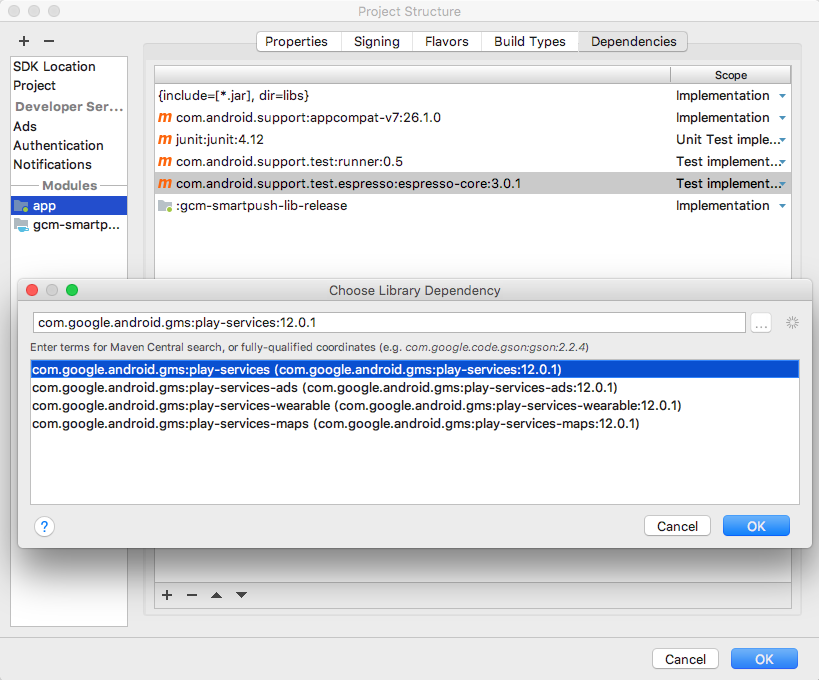

# android-smartpush-lib

A [SMARTPUSH](http://admin.getmo.com.br) é a plataforma de mensagens (push, webpush, sms, email, redes sociais, e chatbots) da [GETMO](http://novo.getmo.com.br). 

#### Requisitos e Dependências

- Android minSdkVersion **11**
- Google Play Services **11.6.0**

### Configurando a biblioteca Android SMARTPUSH 

A biblioteca android do **SMARTPUSH** é responsável por integrar sua aplicação mobile ao backend do **SMARTPUSH** para a gestão do cadastro de dispositivos, tags, geofences, processamento e monitoramento de mensagens push. 

Para adicionar suporte a push em sua aplicação android siga as instruções a seguir.

1. Acesse o [GITHUB](https://github.com/Getmo-Inc/android-smartpush-lib) da GETMO e clone o projeto ou faça o download do arquivo **gcm-smartpush-lib-release.aar**.

2. Abra o seu projeto de aplicação no _Android Studio_ e selecione adicionar um novo _módulo_.



Selecione a opção "Import JAR/AAR Package" conforme a figura abaixo. 



Na próxima tela, clique no botão para navegar pelo seu sistema de arquivos ...



... e encontre o local onde você baixou a biblioteca, selecione o arquivo .aar, pressione OK e então FINISH. 



Agora no "_Project explorer_" selecione sua app, clique com o botão direito do mouse, e
selecione a ação "_open module settings_". Conforme a figura a seguir:



Agora, vamos adicionar a biblioteca Smartpush como uma "_Module Dependency_" do seu projeto. Clique no + dentro da aba "_Dependencies_", então na janela que irá abrir selecione o module :gcm-smartpush-lib-release
e pressione ok. 



Aproveite e também adicione a Google Play Service como uma "_Library Dependency_" do seu projeto. Ela é necessária em conjunto com a biblioteca do Smartpush para ativar o uso de push em sua aplicação.



> **Importante** 
>
> A plataforma Android continua crescendo, e o tamanho dos aplicativos para Android também. Quando um aplicativo e as bibliotecas às quais ele faz referência alcançam determinado tamanho, ocorrem erros de compilação que indicam que o aplicativo chegou ao limite da arquitetura de compilação de aplicativos Android.  
> 
> Você pode ler mais sobre esse problema [aqui](https://developer.android.com/studio/build/multidex.html?hl=pt-br).

Então se ocorrer um erro de compilação uma solução possível é importar apenas as dependências que são necessárias, no caso da biblioteca **Google Play Service** altere o arquivo **build.gradle** da sua aplicação da seguinte forma:
 
```json
dependencies {
    implementation project(':gcm-smartpush-lib-release')
    implementation 'com.google.android.gms:play-services-gcm:12.0.1'
 }
```


Feito isso, o próximo passo é configurar sua app para usar a biblioteca e permitir o cadastramento dos dispositivos, das tags, geofences e o processamento das
mensagens push.


Para isso vamos começar pelo arquivo de manifesto (AndroidManifest.xml) da sua aplicação. 

### Editando o arquivo de Manifesto

Adicione os seguintes itens ao manifesto do app:

* Dentro da tag ```<manifest>``` adicione as permissões abaixo. Elas são necessarias para ativar o recebimento de push a partir da GCM;

```xml
<permission android:name="[PACOTE_SUA_APLICACAO].permission.C2D_MESSAGE" android:protectionLevel="signature" />
<uses-permission android:name="[PACOTE_SUA_APLICACAO].permission.C2D_MESSAGE" />
<uses-permission android:name="android.permission.ACCESS_NETWORK_STATE"/>
```

> Não esqueça de substituir [PACOTE_SUA_APLICACAO] pelo pacote correto da sua aplicação.

* Dentro da tag ```<application>``` adicione as tags de metadados a seguir;

```xml
<meta-data android:name="br.com.smartpush.APPID"  android:value="[SEU_APP_ID]" />
<meta-data android:name="br.com.smartpush.APIKEY" android:value="[SUA_API_KEY]"/>
```

> Não esqueça de substituir [SEU_APP_ID] e [SUA_API_KEY] pelos códigos obtidos no painel de controle do [SMARTPUSH](https://admin.getmo.com.br). Em caso de dúvida de como obter esses códigos consulte [aqui]().


