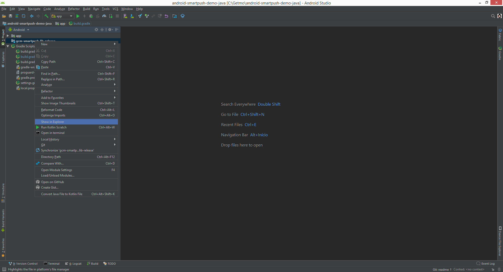
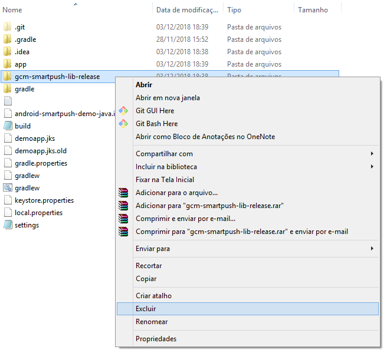

# android-smartpush-lib

A [SMARTPUSH](http://admin.getmo.com.br) é a plataforma de mensagens (push, webpush, sms, email, redes sociais, e chatbots) da [GETMO](http://novo.getmo.com.br). 

#### Requisitos e Dependências

- Android minSdkVersion **16**
- Google Play Services GCM **12.0.1**

### Removendo a biblioteca SMARTPUSH como módulo
Se você já conhece e implementa a biblioteca android do **SMARTPUSH** como um módulo, siga os passos a seguir para remove-la e readiciona-la como uma dependência, mas se você é novo por aqui, apenas siga para o próximo tópico.

1. Abra seu arquivo build.gradle a nível de app e apague a linha de dependência
```json
dependencies {
        implementation project(':gcm-smartpush-lib-release')
 }
```
2. Clique com o botão direito em cima do seu módulo gcm-smartpush-lib-release e abra o local do arquivo

3. Identifique e exclua a pasta do módulo

4. Volte ao AndroidStudio e abra o arquivo settings.gradle e apague o módulo ':gcm-smartpush-lib-release'

Agora você está pronto para seguir para a próxima etapa e adicionar nossa biblioteca como uma dependência

### Adicionando a biblioteca Android SMARTPUSH 

A biblioteca android do **SMARTPUSH** é responsável por integrar sua aplicação mobile ao backend do **SMARTPUSH** para a gestão do cadastro de dispositivos, tags, geofences, processamento e monitoramento de mensagens push.   

Para adicionar suporte a push em sua aplicação android siga as instruções a seguir.

1. Adicione ao seu arquivo build.gradle a nível de projeto, dentro de allprojects repositories
```
allprojects {
    repositories {
        maven { url 'https://jitpack.io' }
    }
}
```
2. Adicione nossa biblioteca à suas dependências ao arquivo build.gradle a nível de módulo
```json
dependencies {
    implementation 'org.bitbucket.getmo:android-smartpush-lib:5.1.7'
 }
```

3. Sincronize o projeto apertando o botão "Sync Now" para baixar a biblioteca para seu projeto.

> **Importante** 
>
> A plataforma Android continua crescendo, e o tamanho dos aplicativos para Android também. Quando um aplicativo e as bibliotecas às quais ele faz referência alcançam determinado tamanho, ocorrem erros de compilação que indicam que o aplicativo chegou ao limite da arquitetura de compilação de aplicativos Android.  
> 
> Você pode ler mais sobre esse problema [aqui](https://developer.android.com/studio/build/multidex.html?hl=pt-br).

Então se ocorrer um erro de compilação uma solução possível é importar apenas as dependências que são necessárias, no caso da biblioteca **Google Play Service** altere o arquivo **build.gradle** da sua aplicação da seguinte forma:
 
```json
dependencies {
    implementation project(':gcm-smartpush-lib-release')
    implementation 'com.google.android.gms:play-services-gcm:16.0.0'
 }
```


Feito isso, o próximo passo é configurar sua app para usar a biblioteca e permitir o cadastramento dos dispositivos, das tags, geofences e o processamento das
mensagens push.


Para isso vamos começar pelo arquivo de manifesto (AndroidManifest.xml) da sua aplicação. 

### Editando o arquivo de Manifesto

Adicione os seguintes itens ao manifesto do app:

* Dentro da tag ```<manifest>``` adicione as permissões abaixo. Elas são necessarias para ativar o recebimento de push a partir da GCM;

```xml
    <uses-permission
        android:name="android.permission.ACCESS_NETWORK_STATE"/>

    <permission
        android:name="[PACOTE_SUA_APLICACAO].permission.C2D_MESSAGE"
        android:protectionLevel="signature" />

    <uses-permission
        android:name="[PACOTE_SUA_APLICACAO].permission.C2D_MESSAGE" />
```

> Não esqueça de substituir [PACOTE_SUA_APLICACAO] pelo pacote correto da sua aplicação.

* Dentro da tag ```<application>``` adicione as tags de metadados a seguir;

```xml
    <meta-data
        android:name="br.com.smartpush.APPID"
        android:value="[SEU_APP_ID]" />

    <meta-data
        android:name="br.com.smartpush.APIKEY"
        android:value="[SUA_API_KEY]"/>
```

> Não esqueça de substituir [SEU_APP_ID] e [SUA_API_KEY] pelos códigos obtidos no painel de controle do [SMARTPUSH](https://admin.getmo.com.br). Em caso de dúvida sobre como obter esses códigos consulte [aqui]().

```xml
    <meta-data
        android:name="br.com.smartpush.default_notification_small_icon"
        android:resource="@drawable/[NOTIFICATION_SMALL_ICON]" />

    <meta-data
        android:name="br.com.smartpush.default_notification_big_icon"
        android:resource="@drawable/[NOTIFICATION_BIG_ICON]" />
        
    <meta-data
        android:name="br.com.smartpush.default_notification_color"
        android:resource="@color/[SUA_COR]" />
```

> Não esqueça de substituir [NOTIFICATION_SMALL_ICON], [NOTIFICATION_BIG_ICON] e [SUA_COR] pelos recursos correspondentes na sua aplicação. Estas propriedades definem os icones pequeno e grande, e também a cor, que devem ser utilizados na notificação.

* Ainda na tag ```<application>``` configure o BroadcastReceiver **com.google.android.gms.gcm.GcmReceiver** ele irá monitorar a chegada de push e encaminhará para o tratador na sua aplicação.

```xml
    <receiver
        android:name="com.google.android.gms.gcm.GcmReceiver"
        android:exported="true"
        android:permission="com.google.android.c2dm.permission.SEND" >
        <intent-filter>
            <action android:name="com.google.android.c2dm.intent.RECEIVE" />
            <category android:name="[PACOTE_SUA_APLICACAO]" />
        </intent-filter>
    </receiver>
```
> Não esqueça de substituir [PACOTE_SUA_APLICACAO] pelo pacote correto da sua aplicação.

* Ainda na tag ```<application>``` configure o Service **SmartpushIDListenerService**  para processar a criação, a rotação e a atualização dos tokens de registro.

```xml
    <service
        android:name="br.com.smartpush.SmartpushIDListenerService"
        android:exported="false">
        <intent-filter>
            <action android:name="com.google.android.gms.iid.InstanceID" />
        </intent-filter>
    </service>
```

* Ainda na tag ```<application>``` configure o Service **SmartpushService** para processar as notificações customizadas (Carrossel, banner, video, etc) e para monitorar os eventos (IMPRESSAO, CLICK, PREVIEW, REDIRECT, etc).

```xml
    <service
        android:name="br.com.smartpush.SmartpushService"
        android:exported="true"/>
```

* Ainda na tag ```<application>``` configure a Activity **SmartpushActivity**, está activity é a responsável por tratar do Player de Video embedado e que é executado a partir de um push.

```xml
    <activity
        android:name="br.com.smartpush.SmartpushActivity"
        android:hardwareAccelerated="true"
        android:launchMode="singleTask"
        android:taskAffinity=""
        android:excludeFromRecents="true" >
        <intent-filter>
            <action android:name="android.intent.action.MAIN" />
            <category android:name="android.intent.category.DEFAULT" />
        </intent-filter>
    </activity>
```

* A última configuração necessária dentro da tag ```<application>``` é de um Service que estenda a classe **SmartpushListenerService** para tratar a criação das notificações, ou outro comportamento desejado, a partir da chegada de um push.

```xml
    <service
        android:name=".MySmartpushListenerService"
        android:exported="false" >
        <intent-filter>
            <action android:name="com.google.android.c2dm.intent.RECEIVE" />
        </intent-filter>
    </service>
```

> O nome da classe pode ser alterada de acordo com sua própria politica de nomeação. O importante é que ela estenda a classe **SmartpushListenerService**.
 
Nessa parte da configuração, o Android Studio, irá indicar um erro, acontece que esse serviço ainda precisa ser criado. Veremos um exemplo mais adiante.

### Criando o serviço para tratar do push e criar notificações

Vamos criar um serviço simples para tratar do push e criar uma notificação. Veja o exemplo abaixo:

```java
import android.app.NotificationManager;
import android.app.PendingIntent;
import android.content.Context;
import android.content.Intent;
import android.media.RingtoneManager;
import android.net.Uri;
import android.os.Bundle;
import android.support.v4.app.NotificationCompat;

import br.com.smartpush.SmartpushListenerService;

/**
 * Created by GETMO on 10/02/16.
 */
public class MySmartpushListenerService extends SmartpushListenerService {

    @Override
    protected void handleMessage( Bundle data ) {
        String message = data.getString( "detail" );

        /**
         * Production applications would usually process the message here.
         * Eg: - Syncing with server.
         *     - Store message in local database.
         *     - Update UI.
         */

        /**
         * In some cases it may be useful to show a notification indicating to the user
         * that a message was received.
         */

        sendNotification( message, data );
    }

    /**
     * Create and show a simple notification containing the received GCM message.
     *
     * @param message GCM message received.
     */
    private void sendNotification( String message, Bundle extras ) {
        Intent intent = new Intent( this, MainActivity.class );
        intent.putExtras( extras );
        intent.addFlags( Intent.FLAG_ACTIVITY_CLEAR_TOP );
        PendingIntent pendingIntent =
                PendingIntent
                        .getActivity(this, 0 /* Request code */, intent, PendingIntent.FLAG_ONE_SHOT);

        Uri defaultSoundUri = RingtoneManager.getDefaultUri(RingtoneManager.TYPE_NOTIFICATION);
        Notification.Builder notificationBuilder = new Notification.Builder( this )
                .setSmallIcon( R.drawable.ic_stat_ic_notification )
                .setContentTitle( "Push Notification!" )
                .setContentText( message )
                .setAutoCancel( true )
                .setSound( defaultSoundUri )
                .setContentIntent( pendingIntent );

        NotificationManager notificationManager =
                ( NotificationManager ) getSystemService( Context.NOTIFICATION_SERVICE );
                                                                    
        if ( android.os.Build.VERSION.SDK_INT >= android.os.Build.VERSION_CODES.O ) {
            int importance = NotificationManager.IMPORTANCE_HIGH;
            NotificationChannel notificationChannel
                    = new NotificationChannel( NOTIFICATION_CHANNEL_ID, "ALERT", importance );
            notificationChannel.enableLights(true);
            notificationChannel.setLightColor(Color.RED);
            notificationChannel.enableVibration(true);
            notificationChannel.setVibrationPattern(
                    new long[]{100, 200, 300, 400, 500, 400, 300, 200, 400});
            notificationBuilder.setChannelId( NOTIFICATION_CHANNEL_ID );
            mNotificationManager.createNotificationChannel(notificationChannel);
        }

        notificationManager.notify( 1000 /* ID of notification */, notificationBuilder.build() );
    }
}
```

### Registrando o dispositivo para receber push

Na Activity principal da sua aplicação adicione no método _onCreate_ uma chamada ao serviço de registro da plataforma Smartpush para ativar a chegada de push e a criação de notificações.

Veja um exemplo:

```java
@Override
    protected void onCreate( Bundle savedInstanceState ) {
        super.onCreate( savedInstanceState );
        setContentView( R.layout.main );

        // Register at Smartpush!
        Smartpush.subscribe( this );
        
        // do something else...
    }
```

Pronto, com isso terminamos a configuração básica para ativar o push. 

Agora, compile seu projeto, instale em um dispositivo, abra a aplicação para que o registro seja efetivado. Vamos dar uma olhada no LOGCAT para ver o que aconteceu.

```
04-08 21:40:56.961 13209-13209/? D/LOG: checkSmartpush() : begin - Configurations tests : br.com.mycompany.MyApp
04-08 21:40:56.971 13209-13209/? D/LOG: checkSmartpush() : Metadata, pass!
04-08 21:40:56.971 13209-13209/? D/LOG: checkSmartpush() : Activity, pass!
04-08 21:40:56.971 13209-13209/? D/LOG: checkSmartpush() : end - Configurations tests : br.com.mycompany.MyApp
04-08 21:40:57.242 13209-14152/? D/LOG: GCM Registration Token: dXbwAUTsFfQ:APA91bH0oEItl6TeUowjFE_vTxWEYwbwdbokn-sA0BGgWAvcgfNoF9mS-sgMPJbIGX9y7ktVeX2mTOq15tc13KTvygY_xIVstxlJdplJZ5_VIKxIUephAua79YhssZ0AF86T4YBTDIgk
04-08 21:40:57.262 13209-14152/? D/LOG: url : https://api.getmo.com.br/device
04-08 21:40:57.262 13209-14152/? D/LOG: method: POST
04-08 21:40:57.262 13209-14152/? D/LOG: params : device=SM-J320M&platformId=ANDROID&devid=CN6Z8Eka3FSQ9IG&uuid=702E265C2321AC0E&appid=AK0Z1AzB1tr31TT&manufacturer=SAMSUNG&regid=dXbwAUTsFfQ%3AAPA91bH0oEItl6TeUowjFE_vTxWEYwbwdbokn-sA0BGgWAvcgfNoF9mS-sgMPJbIGX9y7ktVeX2mTOq15tc13KTvygY_xIVstxlJdplJZ5_VIKxIUephAua79YhssZ0AF86T4YBTDIgk&framework=5.1.1
04-08 21:40:59.314 13209-14152/? D/LOG: rsp : {"status":true,"message":"Success","alias":"E1E18049","hwid":"702E265C2321AC0E"}
04-08 21:40:59.314 13209-14152/? D/LOG: {
                                            "status": true,
                                            "message": "Success",
                                            "alias": "E1E18049",
                                            "hwid": "702E265C2321AC0E"
                                        }
```

A informação importante aqui é o "**alias**" ele é um identificador gerado pela plataforma Smartpush que permite localizar o seu dispositivo na base de dispositivos. 

> Você pode criar seus próprios identificadores, veremos isso quando falarmos em **TAGs**. 

Copie o valor do código "**alias**" e teste o envio de push. Para saber como enviar um push a partir do painel do Smartpush acesse esse [link]().

Para explorar os demais recursos da plataforma Smartpush como criação de **TAGs**, **GEOFENCE**, entre outros acesse os projetos de exemplo disponiveis no [Github](https://github.com/Getmo-Inc/android-smartpush-samples).

Bom era isso! Esperamos que o tutorial seja útil e se tiver qualquer dúvida ou dica envie um email a nossa equipe **developer@getmo.com.br**, teremos o maior prazer em te auxiliar.
